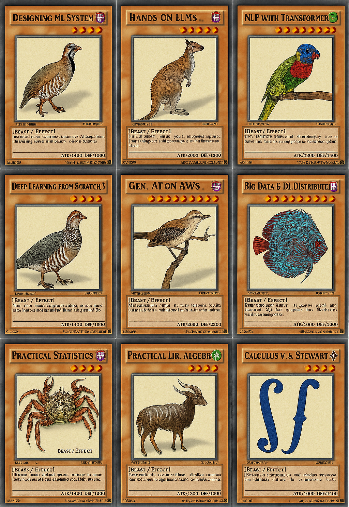

## 🔥 ¡Despierta el Corazón de las Cartas del Machine Learning! 🔥

Confía en el poder de los grandes libros como si fueran tus cartas más valiosas.
Cada modelo que aprendas será un monstruo invocado, cada algoritmo, una carta trampa activada.
¡Usa el corazón de las cartas y despierta al experto en IA que llevas dentro!




---

# Ruta de aprendizaje Intensiva en Machine Learning Aplicado y Deep Learning Moderno (edición 2026)

Esta malla está diseñada para formar expertos en **Machine Learning (ML)**, **Deep Learning (DL)** e **Ingeniería de IA** modernos, cubriendo todos los paradigmas: supervisado, no supervisado, semi-supervisado, auto-supervisado, generativo, por refuerzo y aplicaciones con modelos fundacionales (LLMs, agentes).

Inspirado en programas de **Stanford**, **MIT** y **Harvard**, e incorporando prácticas recomendadas por **McKinsey**, **EY** y **Gartner**, el programa abarca el *stack* dominante en 2026 (PyTorch 2.x, scikit-learn 1.x, Hugging Face, LangGraph/LangChain 1.0, MCP, Polars/DuckDB/Spark 4, PyTorch FSDP, MLflow) y temas transversales (ética, interpretabilidad, storytelling y gobernanza de IA con el **AI Act** de la UE ya en vigor).

Los participantes deben tener formación sólida en **Ingeniería, Estadística, Matemática o Econometría**, con dominio de **matemática superior avanzada**.

> **Cada módulo tiene un notebook propio** (carpeta [`notebooks/`](notebooks/)) que explica la teoría con fórmulas, la implementa **desde cero** en NumPy/PyTorch, la contrasta con la librería estándar, señala el **capítulo verificado** de cada libro y termina con ejercicios. Todos los notebooks se ejecutan en CPU sin claves de API; las celdas que requieren GPU, descargas de pesos o servicios externos están marcadas como `OPCIONAL`.

---

## 🚀 Cómo empezar

```bash
git clone https://github.com/basaravia/advanced-ai-path.git && cd advanced-ai-path
# uv es el gestor de entornos recomendado en 2026 (https://docs.astral.sh/uv/); pip + venv también funciona
uv venv .venv && source .venv/bin/activate        # Windows: .venv\Scripts\activate
uv pip install -r requirements.txt
jupyter lab notebooks/
```

Extras opcionales por módulo (no necesarios para ejecutar los notebooks): `polars duckdb pyspark mlflow` (M9), `transformers accelerate peft trl sentence-transformers` (M5-M6), `diffusers` (M4), `torch_geometric` (M7), `stable-baselines3` (M8), `shap fairlearn` (M10), `langchain langgraph "mcp[cli]" anthropic openai` (M6).

---

## 🎓 Tabla de contenidos

| Módulo | Nombre | Temas principales | Herramientas / Frameworks (2026) | Bibliografía base | **Capítulo / sección verificada** | Notebook |
|:---|:---|:---|:---|:---|:---|:---|
| **1** | **Fundamentos Matemáticos y Programación para IA** | Cálculo multivariable (gradiente, regla de la cadena, Lagrange), álgebra lineal (eigen, SVD, mínimos cuadrados), EDOs numéricas y su vínculo con Neural ODEs/difusión, estadística computacional (bootstrap, permutación), pandas 2 / Polars | NumPy 2, pandas 2, Polars, SciPy, Matplotlib, `uv` | Stewart; Kolman & Hill; Cohen (2022); Zill; Bruce et al. (2020); Zhang et al. (D2L) | • *Stewart*: **Cap. 14** Derivadas parciales (14.3, 14.5-14.8) <br> • *Kolman & Hill*: **Cap. 1, 4, 5, 8** (matrices, espacios vectoriales, producto interno, eigenvalores) <br> • *Cohen*: **Cap. 2-3, 5-6, 11, 13, 14** (vectores, matrices, mínimos cuadrados, eigen, SVD) <br> • *Zill*: **Cap. 1-2, 9** (EDO de primer orden, métodos numéricos) <br> • *Bruce*: **Cap. 1-3** (EDA, distribuciones muestrales, experimentos) <br> • *D2L*: **Cap. 2** + Apéndice matemático | [📓 01](notebooks/01_fundamentos_matematicos_y_programacion.ipynb) |
| **2** | **Machine Learning Clásico (Supervisado, No Supervisado, Semi-supervisado)** | Sesgo-varianza, pipelines sin fuga de datos, regresión regularizada, clasificación (logística, RF, *gradient boosting*), métricas y calibración, umbral por costo, búsqueda de hiperparámetros, clustering (K-means, GMM, DBSCAN), PCA/t-SNE, *self-training* y *label spreading*, **predicción conforme** | scikit-learn 1.9, LightGBM/XGBoost/CatBoost, Optuna, MAPIE | James et al. **ISLP (2023)**; Géron (3.ª ed., 2022); Bruce et al. (2020) | • *ISLP*: **Cap. 2-6, 8, 12** <br> • *Géron*: **Cap. 2** (proyecto de punta a punta), **Cap. 3** (clasificación/métricas), **Cap. 4-9** <br> • *Bruce*: **Cap. 4-7** | [📓 02](notebooks/02_machine_learning_clasico.ipynb) |
| **3** | **Fundamentos de Deep Learning** | MLP y backprop desde cero (con *gradient check*), autograd, bucle de entrenamiento canónico, inicialización/normalización/regularización, AdamW y *schedulers*, CNN, RNN/GRU/LSTM y el gradiente que se desvanece, `torch.compile`, precisión mixta, Keras 3 multi-backend, JAX | **PyTorch 2.x** (principal), Keras 3 (JAX/TF/PyTorch), JAX | Weidman (2019); Zhang et al. (D2L); Géron (2022) | • *Weidman*: **Cap. 1-7** (fundamentos, red desde cero, extensiones, convoluciones, RNN, PyTorch) <br> • *D2L*: **Cap. 3-6** (regresión/clasificación lineal, MLP, guía del constructor), **Cap. 7-8** CNN, **Cap. 9-10** RNN, **Cap. 12** Optimización <br> • *Géron*: **Cap. 10-11, 14-15** | [📓 03](notebooks/03_fundamentos_deep_learning.ipynb) |
| **4** | **Deep Learning Generativo y Auto-supervisado** | Autoencoders (≡ PCA en el caso lineal), VAE (ELBO, reparametrización), GAN y colapso de modo, **DDPM desde cero**, **Flow Matching** (SD3/FLUX), difusión latente, SSL contrastivo (SimCLR) y auto-destilación (DINOv2), MAE, `diffusers` y LoRA | PyTorch, Hugging Face Diffusers, AWS SageMaker/Bedrock | Géron (2022); Zhang et al. (D2L); Fregly et al. (2023) | • *Géron*: **Cap. 17** Autoencoders, GANs y Diffusion Models <br> • *D2L*: **Cap. 20** GANs <br> • *Fregly*: **Cap. 4** (cuantización/distribuido), **Cap. 10** (multimodal), **Cap. 11** (Stable Diffusion) | [📓 04](notebooks/04_deep_learning_generativo_y_autosupervisado.ipynb) |
| **5** | **Modelos de Secuencias: Transformers, LLMs y SSM (Mamba)** | Atención y multi-cabeza desde cero, codificación posicional sinusoidal y **RoPE**, mini-GPT completo (pre-LN, máscara causal, *weight tying*), BPE, KV-cache y muestreo top-p, familias encoder/decoder, ciclo pre-entrenamiento→SFT→RLHF/DPO→RLVR, leyes de escalado, **SSM selectivo (Mamba)** vs atención, arquitecturas híbridas, Hugging Face | PyTorch, Hugging Face Transformers, vLLM | Zhang et al. (D2L); Tunstall et al. (2022); Alammar & Grootendorst (2024); Géron (2022); Fregly et al. (2023) | • *D2L*: **Cap. 11** Atención y Transformers, **Cap. 15-16** NLP <br> • *Tunstall*: **Cap. 1-3** (Hello Transformers, clasificación, anatomía), **Cap. 8** (eficiencia), **Cap. 10** (entrenar desde cero) <br> • *Alammar*: **Cap. 1** Introducción a LLMs, **Cap. 2** Tokens y embeddings, **Cap. 3** Interior de un LLM <br> • *Géron*: **Cap. 16** <br> • *Fregly*: **Cap. 3** | [📓 05](notebooks/05_transformers_llms_y_ssm.ipynb) |
| **6** | **Ingeniería de LLMs: RAG, Agentes, MCP, Evaluación y Fine-tuning** *(nuevo)* | Prompting con salidas estructuradas (Pydantic) e inyección, **RAG** completo (chunking, híbrido BM25+denso, RRF, re-ranking), **bucle de agente** con herramientas, **MCP** y LangGraph 1.0, evaluación (golden set, recall@k, LLM-como-juez), **LoRA desde cero** y PEFT, cuantización e inferencia, arquitectura de referencia | LangChain/LangGraph 1.0, MCP SDK, Anthropic/OpenAI SDK, `peft`/`trl`, vLLM, FAISS/pgvector | **Huyen, *AI Engineering* (2025)**; Alammar & Grootendorst (2024); Fregly et al. (2023) | • *Huyen AIE*: **Cap. 3-4** Evaluación, **Cap. 5** Prompt Engineering, **Cap. 6** RAG y Agentes, **Cap. 7** Finetuning, **Cap. 8** Dataset Engineering, **Cap. 9** Inference Optimization, **Cap. 10** Arquitectura y feedback <br> • *Alammar*: **Cap. 6-8, 10-12** <br> • *Fregly*: **Cap. 2, 5-9, 12** | [📓 06](notebooks/06_ingenieria_llm_rag_agentes.ipynb) |
| **7** | **Graph Neural Networks (GNNs)** | Grafos y algoritmos clásicos (centralidades, PageRank, Louvain), paso de mensajes, **GCN, GraphSAGE, GAT desde cero**, clasificación de nodos semi-supervisada, sobre-suavizado, predicción de enlaces, clasificación de grafos y límite 1-WL (GIN), Graph Transformers, GraphRAG, PyG | NetworkX 3, PyTorch Geometric, Neo4j/Spark GraphFrames | Needham & Hodler (2019); Hamilton (2020, gratuito) | • *Needham & Hodler*: **Cap. 2** conceptos, **Cap. 3** plataformas, **Cap. 4** caminos, **Cap. 5** centralidades, **Cap. 6** comunidades, **Cap. 8** grafos + ML <br> • *Hamilton*: Cap. 5-7 (GNNs) | [📓 07](notebooks/07_graph_neural_networks.ipynb) |
| **8** | **Aprendizaje por Refuerzo** | MDP y Bellman, iteración de valores, SARSA y Q-learning (FrozenLake), **Double DQN** (CartPole), REINFORCE y actor-crítico, PPO, **RLHF / DPO / GRPO** para LLMs, ecosistema (Gymnasium, SB3, CleanRL, TRL) | Gymnasium 1.x, PyTorch, Stable-Baselines3, TRL | Sutton & Barto (2018, gratuito); Géron (2022); Zhang et al. (D2L); Fregly et al. (2023) | • *Sutton & Barto*: **Cap. 3** MDPs, **Cap. 4** Programación dinámica, **Cap. 5** Monte Carlo, **Cap. 6** TD (SARSA, Q-learning), **Cap. 13** Gradiente de política <br> • *Géron*: **Cap. 18** <br> • *D2L*: **Cap. 17** <br> • *Fregly*: **Cap. 7** RLHF | [📓 08](notebooks/08_aprendizaje_por_refuerzo.ipynb) |
| **9** | **Escalado: Big Data, Entrenamiento Distribuido y MLOps** | pandas→Polars/DuckDB→Spark 4, Parquet/Arrow y **lakehouse** (Delta/Iceberg), arquitecturas de datos, **DDP/FSDP/ZeRO** (Horovod deprecado), acumulación de gradientes y presupuesto de memoria, MLOps (tracking, feature store, registro, despliegue), **deriva** (PSI, KS, adversario), pruebas en producción, LLMOps y coste de inferencia | Polars, DuckDB, PySpark 4, PyTorch Distributed/FSDP2, DeepSpeed, Ray, Accelerate, MLflow 3, Evidently, FastAPI | Serra (2024); Huyen, *Designing ML Systems* (2022); Huyen, *AI Engineering* (2025); Géron (2022); D2L | • *Serra*: **Cap. 1-3** (big data, tipos de arquitectura, diseño), **Cap. 10-14** (MDW, data fabric, lakehouse, data mesh) <br> • *Huyen DMLS*: **Cap. 3-6** (datos, features, desarrollo), **Cap. 7** despliegue, **Cap. 8** deriva y monitorización, **Cap. 9** continual learning, **Cap. 10** infraestructura MLOps <br> • *Huyen AIE*: **Cap. 9-10** <br> • *Géron*: **Cap. 19** · *D2L*: **Cap. 13** | [📓 09](notebooks/09_escalado_bigdata_mlops.ipynb) |
| **10** | **Ética, Interpretabilidad, Storytelling y Gobernanza de la IA** | Métricas de equidad y teorema de imposibilidad, mitigación (re-ponderación, umbrales por grupo), importancia por permutación, PDP/ICE, **Shapley exacto** y SHAP, storytelling con datos, model cards generadas desde el pipeline, **AI Act** (calendario 2025-2028), NIST AI RMF, ISO/IEC 42001, red teaming de LLMs | scikit-learn `inspection`, SHAP, Fairlearn, Evidently, C2PA | Huyen DMLS (2022); Huyen AIE (2025); Bruce et al.; EU Ethics Guidelines (2019); Reglamento (UE) 2024/1689; NIST AI RMF; Barocas et al. (gratuito) | • *Huyen DMLS*: **Cap. 11** The Human Side of ML (Responsible AI) <br> • *Huyen AIE*: **Cap. 4-5** <br> • *Bruce*: **Cap. 1, 3** <br> • *EU Ethics Guidelines*: Cap. II (7 requisitos) <br> • *AI Act*: Art. 5, 6 + Anexo III, 50; Cap. V | [📓 10](notebooks/10_etica_interpretabilidad_gobernanza.ipynb) |

---

## 🆕 Qué cambió en la edición 2026 (y por qué)

Esta revisión se hizo **validando cada cita de capítulo contra el índice real de cada libro** (ver [`docs/validacion_bibliografica.md`](docs/validacion_bibliografica.md) con las fuentes consultadas) y actualizando el temario a la práctica profesional vigente:

| Antes | Ahora | Motivo |
|---|---|---|
| Referencias de capítulo imprecisas (p. ej. *D2L Cap. 7-8 "Autoencoders/GANs"*, *Huyen Cap. 7 "ética"*, *Stewart Cap. 4-5*, *Needham Cap. 3*) | Capítulos **verificados** en cada módulo y notebook | En D2L el Cap. 7-8 son CNN y las GAN están en el Cap. 20; en Huyen DMLS la IA responsable es el Cap. 11; Stewart Cap. 14 es el de derivadas parciales; Needham Cap. 3 es sobre plataformas |
| ISL edición R (2021) | **ISLP** edición Python (2023) | El curso es en Python |
| TensorFlow + PyTorch en paridad; Horovod | **PyTorch 2.x** principal; **Keras 3** multi-backend; **DDP/FSDP/DeepSpeed/Ray** | PyTorch domina investigación e industria; Horovod está deprecado (Databricks lo retiró tras 15.4 LTS) |
| Difusión como tema final | **Flow Matching** + difusión latente + SSL (SimCLR/DINOv2/MAE) | Objetivo de entrenamiento de SD3, FLUX y modelos de vídeo actuales; SSL produce los *backbones* visuales estándar |
| "LangChain v0.3" dentro de Transformers | **Módulo 6 nuevo** de Ingeniería de LLMs (RAG, agentes, **MCP**, evaluación, LoRA) con Huyen *AI Engineering* (2025) | La ingeniería de aplicaciones con LLM es hoy una disciplina propia; LangChain/LangGraph 1.0 (oct-2025), MCP donado a la Linux Foundation (ene-2026) |
| Mamba mencionado | SSM selectivo implementado, **Mamba-2/3** e **híbridos** | Mamba-3 (2026) y los híbridos atención+SSM son el estado del arte en eficiencia |
| OpenAI Gym | **Gymnasium** + RLHF/DPO/GRPO | Gym está abandonado; el RL con más impacto es el de alineación y razonamiento de LLMs |
| Spark/MLlib | Polars/DuckDB → Spark 4, lakehouse, LLMOps | Escala por etapas; la mayoría de los equipos no necesita un clúster |
| AI Act como "regulación futura" | AI Act **en vigor**: prohibiciones (feb-2025), GPAI (ago-2025), transparencia (ago-2026), alto riesgo Anexo III (dic-2027, aplazado), Anexo I (ago-2028) | Calendario verificado en artificialintelligenceact.eu (sep-2026) |
| Sin notebooks | **10 notebooks ejecutables** en CPU, sin claves de API | Aprender implementando desde cero y comparando con la librería estándar |
| Sin enlaces al material de los libros | Sección **📦 Recursos** en cada notebook + [`docs/recursos_repositorios.md`](docs/recursos_repositorios.md) | Los repos oficiales (handson-ml3, ISLP_labs, D2L, HandsOnLLM, nlp-with-transformers, DLFS_code, LinAlg4DataScience, gedeck, generative-ai-on-aws, aie-book, dmls-book, Sutton & Barto en Python) traen notebooks y datasets reales listos para practicar |

---

## 📈 Skills clave adquiridos
- **Machine Learning**, **Deep Learning** e **IA generativa** modernos (difusión, flow matching, LLMs, SSM).
- **Ingeniería de IA**: RAG, agentes con herramientas (MCP), evaluación con jueces, fine-tuning eficiente (LoRA), optimización de inferencia.
- **Big Data** y **entrenamiento distribuido** (FSDP, DeepSpeed, Ray) y **MLOps/LLMOps**.
- **Storytelling con datos** para distintos públicos.
- **Ética, interpretabilidad y gobernanza de IA** según el AI Act, NIST AI RMF e ISO/IEC 42001.
- **Comunicación interdisciplinaria** y **trabajo en equipo**.

---

## 📌 Notas importantes
- **Hardware:** todos los notebooks corren en CPU. Para GPU: NVIDIA CUDA 12.x, Apple Metal (MPS) o AMD ROCm; PyTorch 2.x los detecta con `torch.accelerator`.
- **Entrenamiento distribuido:** PyTorch DDP/FSDP2, DeepSpeed ZeRO, Ray Train, Hugging Face Accelerate. (Horovod y TF `MirroredStrategy` se mencionan solo como contexto histórico.)
- **LLMs y agentes:** Hugging Face Transformers, vLLM, LangGraph/LangChain 1.0, MCP, SDKs de Anthropic/OpenAI; los notebooks incluyen un LLM simulado para aprender la mecánica sin coste.
- **Regulación:** el calendario del AI Act cambió con el *Digital Omnibus* (2025-26); verifica siempre la fecha vigente antes de un despliegue.

---

## 📚 Bibliografía principal

Índices verificados en septiembre de 2026 (repositorios oficiales de código y páginas de los autores; detalle en [`docs/validacion_bibliografica.md`](docs/validacion_bibliografica.md)). Los notebooks, datasets y utilidades que ofrece cada repositorio, y cómo se aprovechan por módulo, están en [`docs/recursos_repositorios.md`](docs/recursos_repositorios.md); además, cada notebook de la malla termina con una sección **📦 Recursos de los repositorios oficiales** con enlaces directos (Colab) al capítulo correspondiente.

1. **Bruce, P., Bruce, A. & Gedeck, P. (2020).** *Practical Statistics for Data Scientists: 50+ Essential Concepts Using R and Python* (2nd ed.). O'Reilly. Código: <https://github.com/gedeck/practical-statistics-for-data-scientists>
2. **James, G., Witten, D., Hastie, T., Tibshirani, R. & Taylor, J. (2023).** *An Introduction to Statistical Learning with Applications in Python* (ISLP). Springer. Gratuito: <https://www.statlearning.com/> · Labs: <https://github.com/intro-stat-learning/ISLP_labs>
3. **Zhang, A., Lipton, Z. C., Li, M. & Smola, A. J. (2023).** *Dive into Deep Learning*. Cambridge University Press / d2l.ai. Gratuito: <https://d2l.ai/>
4. **Stewart, J.** *Cálculo de varias variables. Trascendentes tempranas* (7.ª/8.ª ed.). Cengage.
5. **Kolman, B. & Hill, D. R.** *Álgebra Lineal* (8.ª ed.). Pearson.
6. **Zill, D. G.** *Ecuaciones diferenciales con aplicaciones de modelado* (9.ª/10.ª ed.). Cengage.
7. **Alammar, J. & Grootendorst, M. (2024).** *Hands-On Large Language Models: Language Understanding and Generation*. O'Reilly. Código: <https://github.com/HandsOnLLM/Hands-On-Large-Language-Models>
8. **Cohen, M. X. (2022).** *Practical Linear Algebra for Data Science: From Core Concepts to Applications Using Python*. O'Reilly. Código: <https://github.com/mikexcohen/LinAlg4DataScience>
9. **Fregly, C., Barth, A. & Eigenbrode, S. (2023).** *Generative AI on AWS*. O'Reilly. Código: <https://github.com/generative-ai-on-aws/generative-ai-on-aws>
10. **Géron, A. (2022).** *Hands-On Machine Learning with Scikit-Learn, Keras, and TensorFlow* (3rd ed.). O'Reilly. Código: <https://github.com/ageron/handson-ml3>
11. **Huyen, C. (2022).** *Designing Machine Learning Systems: An Iterative Process for Production-Ready Applications*. O'Reilly. Recursos: <https://github.com/chiphuyen/dmls-book>
12. **Huyen, C. (2025).** *AI Engineering: Building Applications with Foundation Models*. O'Reilly. Recursos: <https://github.com/chiphuyen/aie-book> *(nuevo)*
13. **Needham, M. & Hodler, A. E. (2019).** *Graph Algorithms: Practical Examples in Apache Spark and Neo4j*. O'Reilly.
14. **Serra, J. (2024).** *Deciphering Data Architectures: Choosing Between a Modern Data Warehouse, Data Fabric, Data Lakehouse, and Data Mesh*. O'Reilly.
15. **Tunstall, L., von Werra, L. & Wolf, T. (2022).** *Natural Language Processing with Transformers* (revised ed.). O'Reilly. Código: <https://github.com/nlp-with-transformers/notebooks>
16. **Weidman, S. (2019).** *Deep Learning from Scratch: Building with Python from First Principles*. O'Reilly. Código: <https://github.com/SethHWeidman/DLFS_code>
17. **Sutton, R. S. & Barto, A. G. (2018).** *Reinforcement Learning: An Introduction* (2nd ed.). MIT Press. Gratuito: <http://incompleteideas.net/book/the-book-2nd.html>

### Lecturas complementarias gratuitas (añadidas en 2026)
- **Hamilton, W. L. (2020).** *Graph Representation Learning*. <https://www.cs.mcgill.ca/~wlh/grl_book/>
- **Barocas, S., Hardt, M. & Narayanan, A. (2023).** *Fairness and Machine Learning*. MIT Press. <https://fairmlbook.org>
- **Molnar, C. (2025).** *Interpretable Machine Learning* (3.ª ed.). <https://christophm.github.io/interpretable-ml-book/>
- **Holderrieth, P. & Erives, E. (2025).** *An Introduction to Flow Matching and Diffusion Models* (MIT 6.S184). arXiv:2506.02070.
- **Comisión Europea.** *Reglamento (UE) 2024/1689 (AI Act)* y calendario: <https://artificialintelligenceact.eu/implementation-timeline/> · **NIST AI RMF 1.0** (2023) · **ISO/IEC 42001:2023**.
- Documentación oficial: PyTorch 2.x, scikit-learn 1.9, Hugging Face, LangChain/LangGraph 1.0, Model Context Protocol, Gymnasium, PyTorch Geometric, Polars, DuckDB, Apache Spark 4, MLflow.

---

## 📜 Licencia

[](https://creativecommons.org/licenses/by-nc-sa/4.0/)  
Este repositorio está licenciado bajo una [Licencia Creative Commons Atribución-NoComercial-CompartirIgual 4.0 Internacional](https://creativecommons.org/licenses/by-nc-sa/4.0/).  
© 2025-2026 Alexander Saravia
